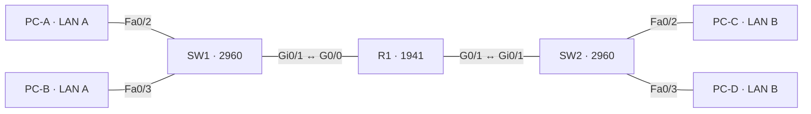

# Project 01 — Small routed LAN with DHCP

A beginner Cisco Packet Tracer lab that connects two small IPv4 LANs through one router. The router provides DHCP to both LANs and routes traffic between them. Each LAN has its own Layer 2 access switch.

> **Project status:** Build guide and configurations are prepared. The native Packet Tracer file and real screenshots still need to be created and verified in Packet Tracer. The image below is an explicit placeholder, not a lab capture.

## What this lab demonstrates

- Plan two non-overlapping IPv4 `/24` networks.
- Configure router interfaces as the default gateways.
- Configure two DHCP pools on a Cisco IOS router.
- Connect end devices through Layer 2 access switches.
- Explain why local DHCP broadcasts work without a relay, while routers separate broadcast domains.
- Verify interface state, DHCP leases, connected routes, MAC learning, and end-to-end reachability.
- Troubleshoot common Layer 1, Layer 2, Layer 3, and DHCP faults.

This is a small, isolated LAN lab. It has no ISP, Internet access, DNS server, VLAN trunk, or switch management address.

## Topology

Use a Cisco 1941 router, two Catalyst 2960-24TT switches, and four PCs in Packet Tracer. Equivalent devices are fine if they expose the same interfaces and commands.

The router has one physical interface in each IP subnet. Those interfaces create the two connected routes and separate the LANs into different broadcast domains. Each switch forwards frames within its own LAN and learns source MAC addresses. The switches use their default access VLAN; this lab does not configure VLANs or trunks.

## Addressing plan

| Segment / device | Interface | IPv4 address | Mask / prefix | Purpose |
|---|---|---:|---|---|
| LAN A | R1 G0/0 | 192.168.10.1 | 255.255.255.0 (/24) | LAN A default gateway and DHCP server |
| LAN A | PC-A, PC-B | DHCP | 255.255.255.0 (/24) | Client addresses from 192.168.10.21–254 |
| LAN B | R1 G0/1 | 192.168.20.1 | 255.255.255.0 (/24) | LAN B default gateway and DHCP server |
| LAN B | PC-C, PC-D | DHCP | 255.255.255.0 (/24) | Client addresses from 192.168.20.21–254 |

The router reserves `.1` through `.20` in each subnet for gateways, infrastructure, or future static assignments. DHCP clients receive the matching subnet mask and default gateway. See [the addressing plan](docs/addressing-plan.md).

## Build it in Packet Tracer

1. Place one **1941 router**, two **2960-24TT switches**, and four **PC-PT** devices.
2. Connect R1 G0/0 to SW1 Gi0/1; connect R1 G0/1 to SW2 Gi0/1.
3. Connect PC-A and PC-B FastEthernet0 to SW1 Fa0/2 and Fa0/3. Connect PC-C and PC-D FastEthernet0 to SW2 Fa0/2 and Fa0/3. Use Copper Straight-Through or Packet Tracer's automatic connection tool.
4. Apply the device configurations in [configs/](configs/). The router interfaces must be enabled with `no shutdown`.
5. On each PC, open **Desktop → IP Configuration → DHCP**.
6. Save the native simulation as `packet-tracer/routed-lan-dhcp.pkt`.
7. Run the checks in [verification and troubleshooting](docs/verification-and-troubleshooting.md), fix any failures, save again, and capture your own Packet Tracer evidence.

A step-by-step save and evidence checklist is in [packet-tracer/](packet-tracer/README.md) and [screenshots/](screenshots/README.md).

## Configurations

- [R1 — router and DHCP pools](configs/R1.txt)
- [SW1 — LAN A access switch](configs/SW1.txt)
- [SW2 — LAN B access switch](configs/SW2.txt)

Paste each configuration from privileged EXEC mode using `configure terminal`, then save with `copy running-config startup-config`.

## Verification checklist

Do not mark a check complete until you have run it in Packet Tracer and recorded the observed result.

- [ ] All router and switch links are up.
- [ ] Each PC receives an address in the correct subnet, a `/24` mask, and the correct gateway.
- [ ] Each PC can ping its local gateway.
- [ ] PCs can ping other PCs on the same LAN.
- [ ] A PC in LAN A can ping a PC in LAN B, and vice versa.
- [ ] R1 shows both LANs as directly connected routes.
- [ ] R1 shows active DHCP bindings for the clients.
- [ ] Each switch learns client MAC addresses on the expected access ports.

Detailed commands, expected conditions, and fault-injection exercises are in [docs/verification-and-troubleshooting.md](docs/verification-and-troubleshooting.md). No test results are claimed until recorded from the simulator.

## Evidence

Replace this clearly marked graphic with a real Packet Tracer topology screenshot after completing the lab.

See [screenshots/README.md](screenshots/README.md) for the requested captures and suggested filenames. Do not present placeholder art as a simulator screenshot.

## Design notes and limitations

- Both subnets are directly connected to R1, so IOS installs connected routes automatically when the interfaces are up. No static route or dynamic routing protocol is needed in this topology.
- Each DHCP Discover is a local broadcast and reaches R1 on that LAN. Because the DHCP server is on the router, no `ip helper-address` relay is needed. A DHCP server on a different routed network would require a relay on the client-facing router interface.
- A router does not forward Layer 2 broadcasts between these LANs.
- DNS is intentionally omitted: there is no DNS server in this isolated lab. A public DNS address would not be reachable without an Internet path.
- These are lab configurations, not production hardening. No real credentials or secrets are included.
- Packet Tracer command availability can vary by device model and simulated IOS image. If an equivalent device differs, record the model and any command adjustment.

## References

- [Cisco IOS DHCP server configuration guide](https://www.cisco.com/c/en/us/td/docs/ios-xml/ios/ipaddr_dhcp/configuration/12-4/dhcp-12-4-book/config-dhcp-server.html)
- [Cisco Catalyst 2960 command reference — MAC address table](https://www.cisco.com/c/en/us/td/docs/switches/lan/catalyst2960/software/release/15-0_2_ez/command/reference/cr2960/cli2.html)
- [Cisco Catalyst 2960 command reference — spanning-tree PortFast](https://www.cisco.com/c/en/us/td/docs/switches/lan/catalyst2960/software/release/15-0_2_ez/command/reference/cr2960/cli3.html)
